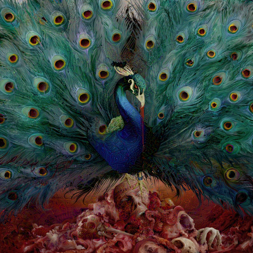
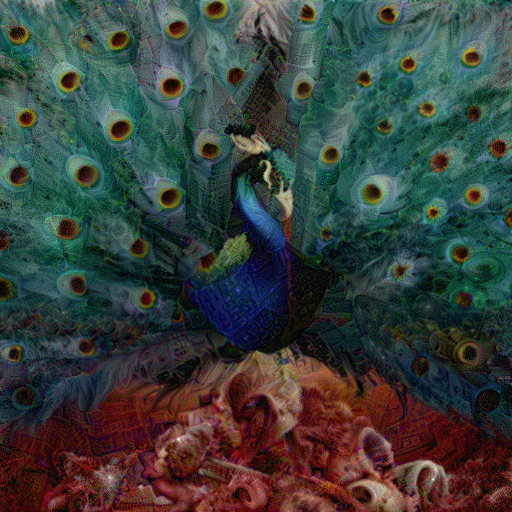
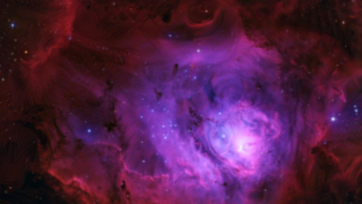
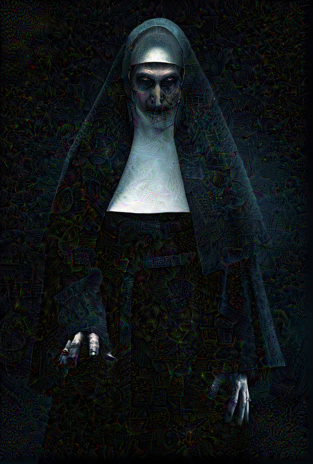

# Deep Dream - Dream with Neural Networks

This is an implementation of Deep Dream using Tensorflow. 

* Deep Dream is an experiment that visualizes the patterns learned by a neural network. Similar to when a child watches clouds and tries to interpret random shapes, DeepDream over-interprets and enhances the patterns it sees in an image.

* It does so by forwarding an image through the network, then calculating the gradient of the image with respect to the activations of a particular layer. The image is then modified to increase these activations, enhancing the patterns seen by the network, and resulting in a dream-like image. This process was dubbed "Inceptionism" (a reference to InceptionNet, and the movie Inception).

## Images Dreamt by Deep Dream

Refer [deep_dream.ipynb](deep_dream.ipynb) for detailed explanation of Deep Dream and its use.

* Opeth - Sorceress (album art)

* Galaxy

* Valak

## Requirements

This was done on [Google Colab](www.colab.research.google.com).

Python 3 is required. Install the required libraries using the [pip](https://pip.pypa.io/en/stable/) package manager and requirements.txt file.

For pip version 19.1 or above:

~~~bash
pip install -r requirements.txt --user
~~~

or

~~~bash
pip3 install -r requirements.txt --user
~~~

## About DeepDream

* DeepDream is a computer vision program created by Google engineer **Alexander Mordvintsev** which uses a convolutional neural network to find and enhance patterns in images via algorithmic pareidolia, thus creating a dream-like hallucinogenic appearance in the deliberately over-processed images.

## License

Copyright 2019 Tensorflow Authors

Licensed under the Apache License, Version 2.0 (the "License");
you may not use this file except in compliance with the License.
You may obtain a copy of the License at

    http://www.apache.org/licenses/LICENSE-2.0

Unless required by applicable law or agreed to in writing, software
distributed under the License is distributed on an "AS IS" BASIS,
WITHOUT WARRANTIES OR CONDITIONS OF ANY KIND, either express or implied.
See the License for the specific language governing permissions and
limitations under the License.